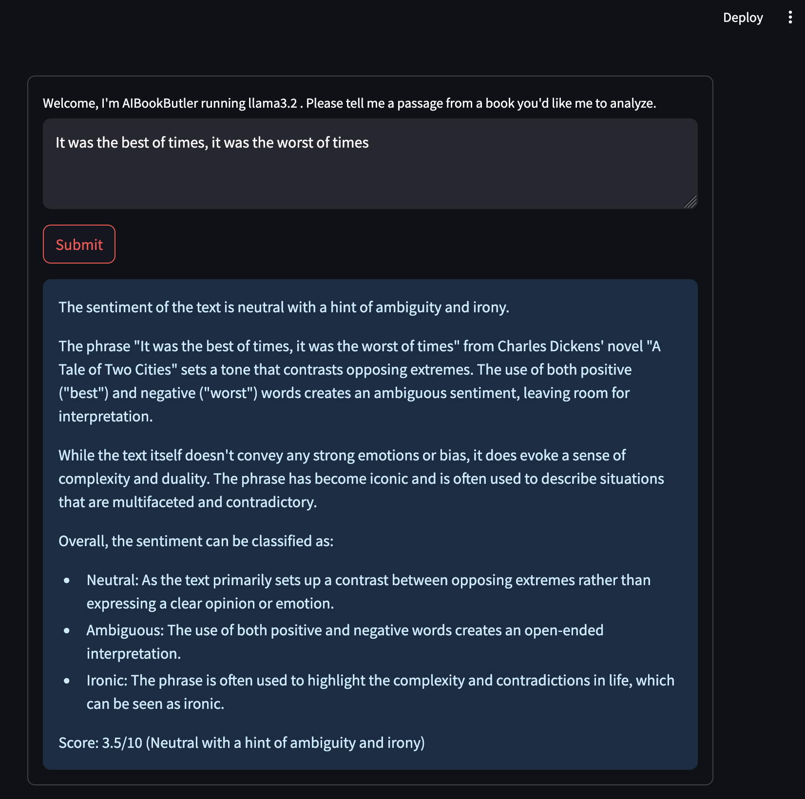

# AIBookButler

This repo contains code that uses LLMs to act like a "book butler" (see "Usage" below for available tasks).
The focus is being simple and lightweight, so all code runs locally, calling open-source LLMs via Ollama,
though you can swap this out for cloud-hosted commercial LLM providers if you'd like. 

## Usage

Currently available functions are:

- `Vector search`: recommend a book similar to what the user inputs (eg. "a book about sailing") from the "7K books" dataset from Kaggle

- `Sentiment analysis`: analyze the sentiment of a text passage via a web-based interactive prompt

## Acknowledgements

Thank you to Dan Sommer for very useful LLM discussions.

## TO-DOs

- Additional chat UI in Gradio
- Chat feedback
- Text summarization
- Benchmark accuracy between different embeddings and/or LLMs
